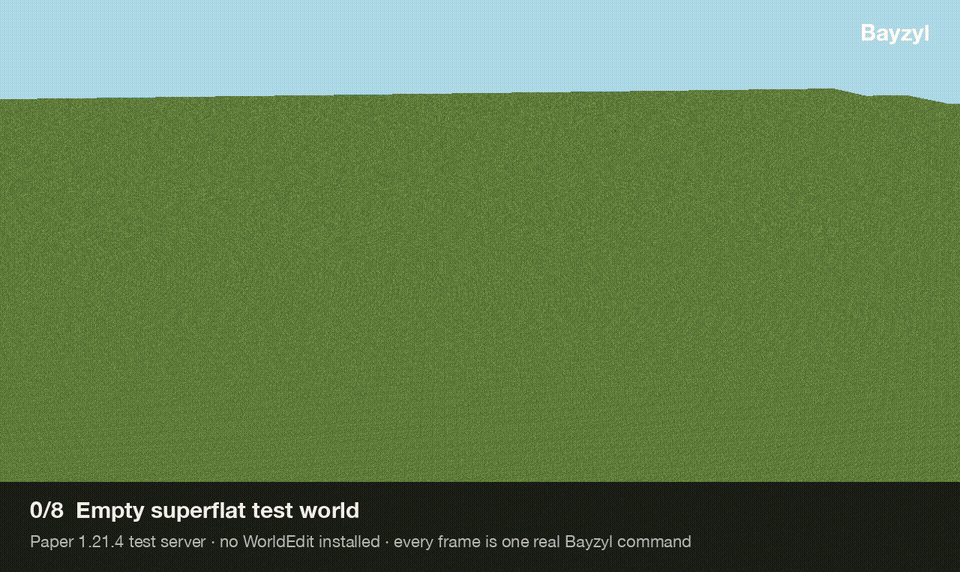
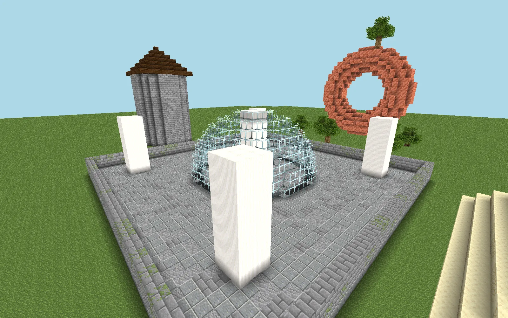
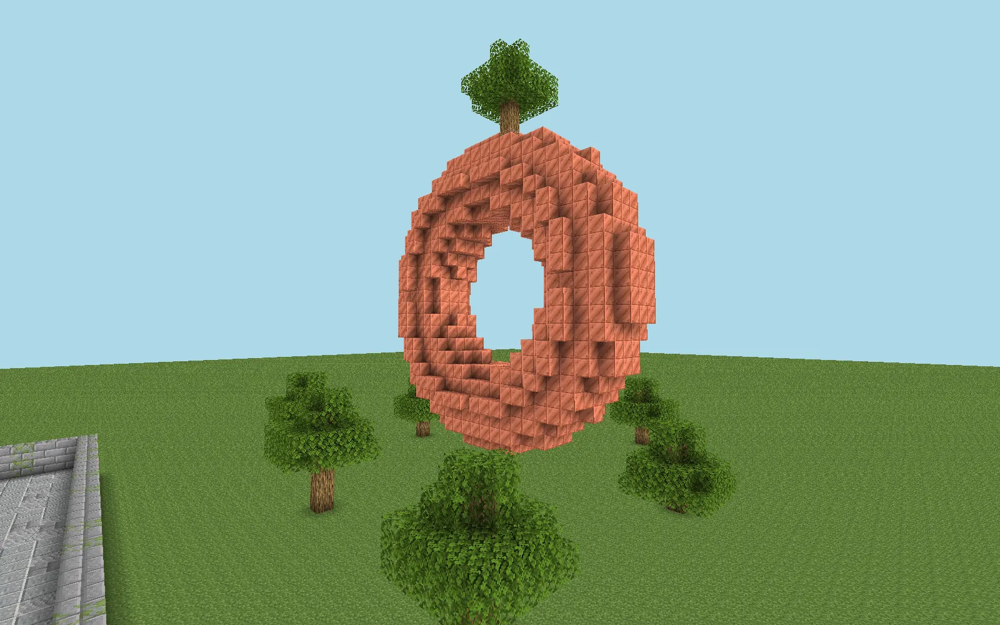
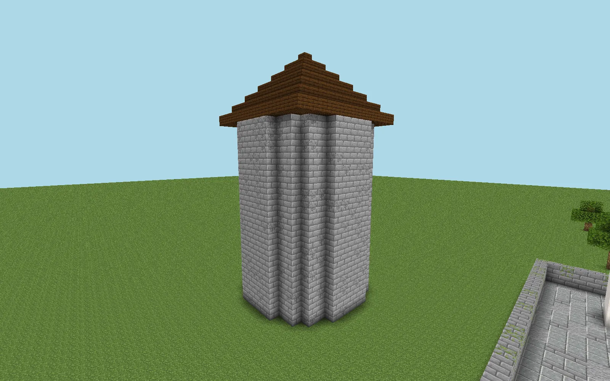
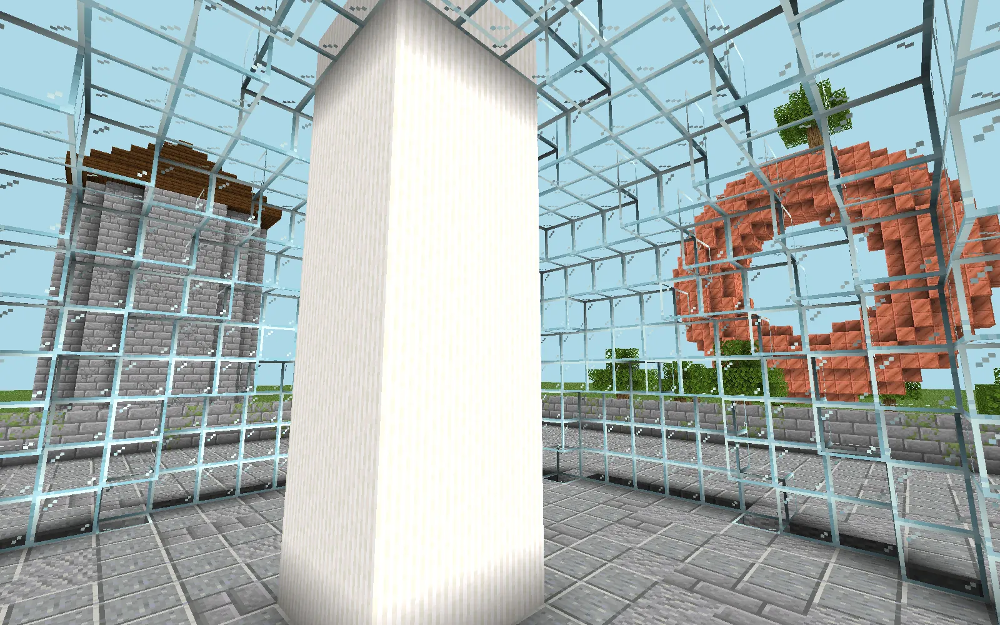
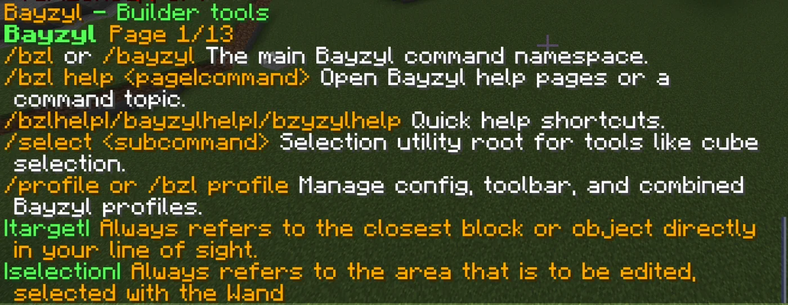
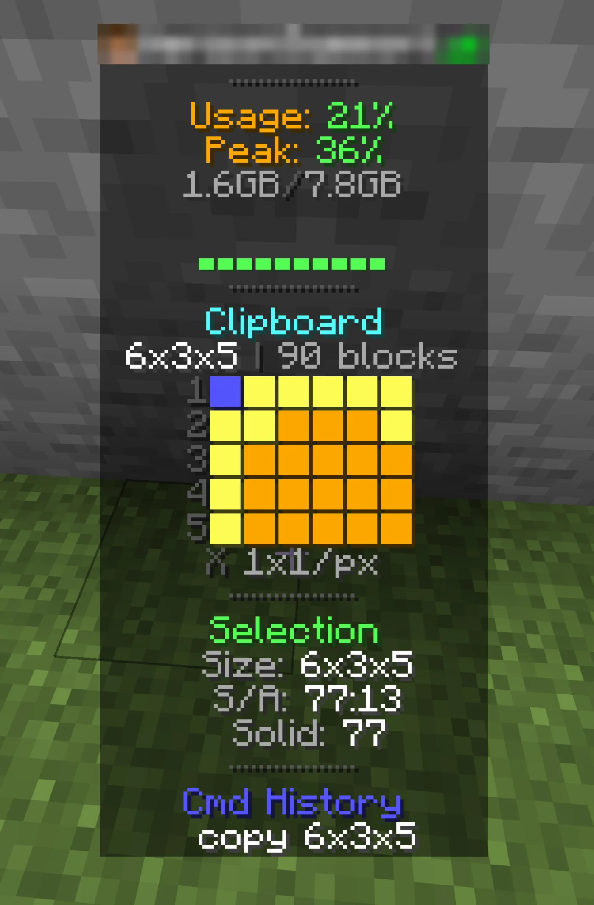

# Bayzyl

> Just stuff I thought would be useful for the things I want to do. If you think they will be useful for you too feel free to use them as well, just PLEASE dont try and sell it, helpful code should be for everyone. If you use this as a part of another free program credit would be nice smile :).

**An in-game building toolkit for Paper servers.**

Selections, brushes, shapes, shared kits, and builder profiles — with a command surface that aims to be approachable for newer builders while staying useful for those already comfortable in WorldEdit or FAWE.



*Every frame above is one real Bayzyl command on a clean Paper 1.21.4 server with no WorldEdit installed. Renders use vanilla textures.*

## Current update: 0.2.0-alpha.2

[Download the pre-release](https://github.com/sagedeutschle/Bayzyl/releases/tag/v0.2.0-alpha.2) · [Update notes](docs/releases/0.2.0-alpha.2.md) · [Changelog](CHANGELOG.md)

This alpha adds durable clipboard recovery, `/resume` for interrupted copies, and a read-only Redstone Audit (`/redstoneaudit` or `/bzl audit`). It also adds stricter edit limits, permission checks, safer shutdown, partial undo history for cancelled edits, and fixes for clipboard transforms, brush codes, and shared kit overwrites.

Use a backed-up test world first. This remains an alpha; undo is not a full world backup. The [release notes](docs/releases/0.2.0-alpha.2.md#known-limits) describe recovery, entity, and compatibility limits.

---

## Overview

Bayzyl is a full editing workflow for Paper servers — selections, shapes, brushes, clipboards, history, shared kits, and builder profiles — packaged as a consistent, builder-friendly command set.

Bayzyl is designed to play nicely with [WorldEdit](https://enginehub.org/worldedit/) and [FastAsyncWorldEdit](https://www.spigotmc.org/resources/fastasyncworldedit.13932/) — both are great tools and Bayzyl is happy sitting alongside them. Bayzyl auto-detects WorldEdit-compatible plugins for supported shape operations while keeping its native edit, history, selection, brush, and clipboard behavior available without external dependencies.

**What Bayzyl focuses on**

- **Consistent command syntax** — every option uses `option:value` form, and tab-completion is aware of selections, masks, distributions, and player context. `/bzlhelp` indexes everything.
- **Forgiving by default** — confirmations on large operations, per-player undo history that persists across restarts, and `/oops` to undo with a broadcast so your teammates know.
- **Built for teams** — shared builder kits with themes, icons, aliases, and notes; named profiles for full loadout switching; server-side selection bookmarks.
- **Quality of life** — auto-unstick, ghost-hand mode, ruler, surface/ascend/descend teleports, snap-to-cardinal alignment, RAM alerts, and a tab info panel.

---

## Features

### Selection & navigation
`/wand` `/selcorners` `/selswap` `/selsave` `/selload` `/selcenter` `/expand` `/contract` `/whereami` `/ruler` `/measure` `/surface` `/ascend` `/descend` `/align` `/ceil` `/centerme` `/thru` `/unstick`

### Edit operations
`/set` `/replace` `/copy` `/cut` `/paste` `/move` `/stack` `/rotate` `/flip` `/walls` `/overlay` `/smooth` `/naturalize` `/cleanup`

### Shapes
`/sphere` `/hsphere` `/dome` `/hdome` `/bowl` `/hbowl` `/cyl` `/hcyl` `/pyramid` `/hpyramid` `/generate` (formula-driven)

### Brushes
Bind reusable brushes to any held item with `/brush sphere|hsphere|cyl|hcyl|pyramid|hpyramid|clipboard|paint|naturalize|smooth|raise|lower|flatten|erase|surface|noise|spatter|blend|vegetation|decay` and more. Live-tweak them with `/mask` `/material` `/size` `/density` without rebinding.

### Detail brushes
Preset paint brushes for fire, clouds, lightning, vines, roots, and bark — each with its own purpose-built parameters (heat, flicker, height, branches, etc.) and a curated palette. `/detailbrush tool flame` to bind, `/detailbrush set heat 0.9` to tweak, `/detailbrush save mybrush` to persist a variant. Quick-load with overrides: `/db thunderbolt red`, `/db jungle-vine jungle`. See [`docs/DETAIL_BRUSHES.md`](docs/DETAIL_BRUSHES.md) for the system design.

### Generation
`/forestgen` `/pumpkins` `/generatebiome` `/biomeinfo`

### Builder profiles & shared kits
Save a complete loadout (toolbar, runtime toggles, preferences) as a profile. Share themed kits across the server with `/kit menu`, `/kitmake`, `/kitupdate`. Kits support themes, icons, aliases, and inline notes.

### History
`/undo` `/redo` `/oops` (broadcast undo) — persistent across server restarts, per-player.

### Recovery and audit
`/resume` retries an interrupted copy using its saved selection. Saved clipboards have a 250,000-block recovery cap. `/redstoneaudit` inspects a loaded selection without changing blocks; `show`, `page`, and `clear` manage its findings and temporary private markers.

### Server-side QoL
RAM alerts with configurable thresholds, a tab info panel, decoy player count for events, runtime admin/builder toggles.

## Screenshots

| | |
|---|---|
|  |  |
| `/hsphere glass 9`, `/cyl quartz_pillar 1 9`, `/walls 70%stone_bricks,30%mossy_stone_bricks` | `/generate copper_block (sqrt(x*x+y*y)-0.62)*(sqrt(x*x+y*y)-0.62)+z*z<0.05`, `/forestgen 16 oak 5` |
|  |  |
| `/hcyl 75%stone_bricks,25%cracked_stone_bricks 6 18`, `/hpyramid dark_oak_planks 7` | Weighted block mixes (`60%polished_andesite,25%andesite,15%stone_bricks`) on the floor |

In game, `/bzlhelp` pages every command, and the tab panel shows live server memory, a clipboard preview, selection stats, and recent commands:

| | |
|---|---|
|  |  |

---

## Install

1. Back up your worlds and `plugins/Bayzyl/`, then stop the server.
2. Download `bayzyl-0.2.0-alpha.2.jar` and its SHA-256 file from the [pre-release](https://github.com/sagedeutschle/Bayzyl/releases/tag/v0.2.0-alpha.2). Verify the checksum.
3. Replace the old Bayzyl JAR in your server’s `plugins/` folder; keep only one Bayzyl JAR.
4. Start the server and check its log for version `0.2.0-alpha.2`.
5. *(Optional)* WorldEdit enables schematic file import/export and supported shape adapters.

**Requirements**

- Release target: Paper **1.21.11** with **Java 21**. See the release assets for the exact build receipt and runtime checks.
- The existing screenshots show alpha.1 on Paper 1.21.4; they are not new-release test evidence.
- WorldEdit is optional. FAWE, Folia, Minecraft 26.x, and other server versions are not verified for this release.

Spigot, Folia, Forge, and Fabric ports are on the v2 roadmap.

---

## Quick start

```
/wand                        # get the selection wand
/sphere stone 12             # build a stone sphere centered on you
/brush sphere stone 5        # bind a stone-sphere brush to your held item
/mask grass_block,dirt       # mask: only affect grass and dirt
/paste at:target             # paste your clipboard at the block you're looking at
/oops                        # undo and broadcast
/bzlhelp                     # browse all topics
```

Block distributions work everywhere a block is accepted:

```
/set 60%stone,30%cobblestone,10%mossy_cobblestone
/brush paint 5 oak_leaves density:0.3 mask:grass_block
```

---

## Build from source

```bash
git clone https://github.com/sagedeutschle/Bayzyl.git
cd Bayzyl
./gradlew build
```

The compiled jar lands in `build/libs/`. Requires Java 21+.

Design notes for individual systems live in [`docs/`](docs/): [detail brushes](docs/DETAIL_BRUSHES.md), [parametric noise brushes](docs/PARAMETRIC_NOISE_BRUSHES.md), and [WorldEdit parity](docs/TOOL_WORLDEDIT_PARITY.md). A Python [terrain schematic generator](terrain_schematic_generator/) is included as an experimental tool.

---

## Roadmap

Planned v2 work, highlights:

- **BzlBlender** — optional Fabric companion mod for client-side ghost rendering and floating GUI panels
- **Vanilla generator tools** — Bayzyl-style wrappers around `/place feature`, bounded chunk regen, parametric noise brushes
- **Server maintenance pillar** — tick profiling, build impact reports, optimization suggestions
- Multi-platform ports: Spigot, Folia, Forge, Fabric

---

## Contributing

Bayzyl is in active solo development. Issues and pull requests are welcome — please open an issue first for anything non-trivial so we can sync on direction before code is written.

## License

Bayzyl is released under the [MIT License](LICENSE). Use it on personal or commercial servers, fork it, redistribute it — just keep the copyright notice.

---

*Built by [@sagedeutschle](https://github.com/sagedeutschle).*
