# Fiverr kit — fiverr.com/bayzyl

Everything to paste into Fiverr, plus the images in [`out/`](out/). Generated from
[`gigs.json`](gigs.json) by `node showcase/fiverr/kit.mjs`, which also checks every field
against Fiverr's limits. Edit the JSON, not this file.

> **Prices are starting points.** They sit in the middle of what similar gigs charge. Set
> your own before publishing. Fiverr adds its service fee on top for buyers.

## Images in this kit

Every image is built from real work: App Store screenshots, THE HELM widgets rendered from
their QML source, Playwright captures of the live qr-scanner tools, and text pulled straight
from Bayzyl's help pages and command registry. Diagrams are labeled as diagrams.
All are 1280×769 at 2× (2560×1538 PNG), Fiverr's recommended gig image ratio.

| Gig covers | Portfolio boards |
|---|---|
| 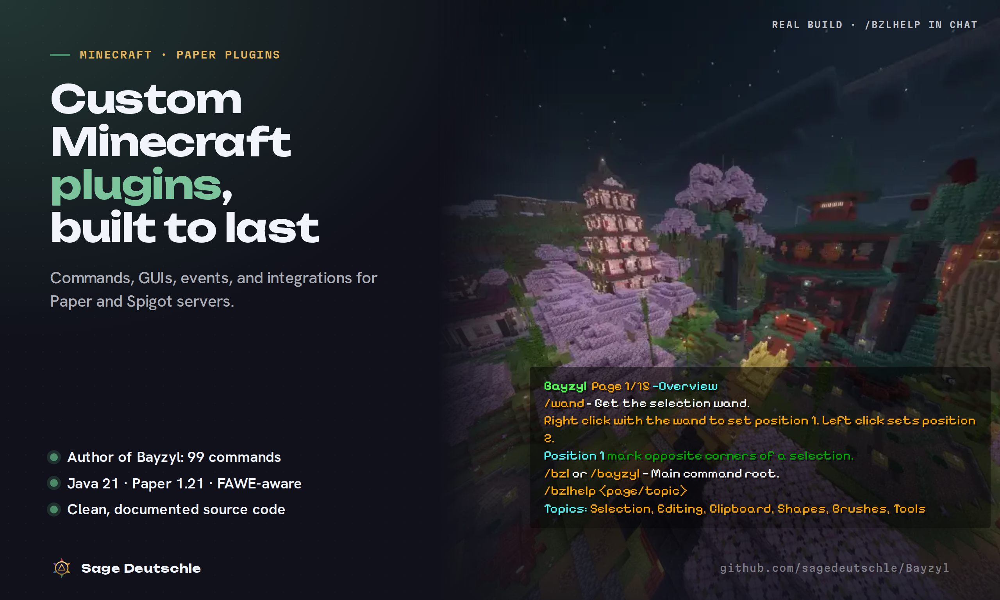 | 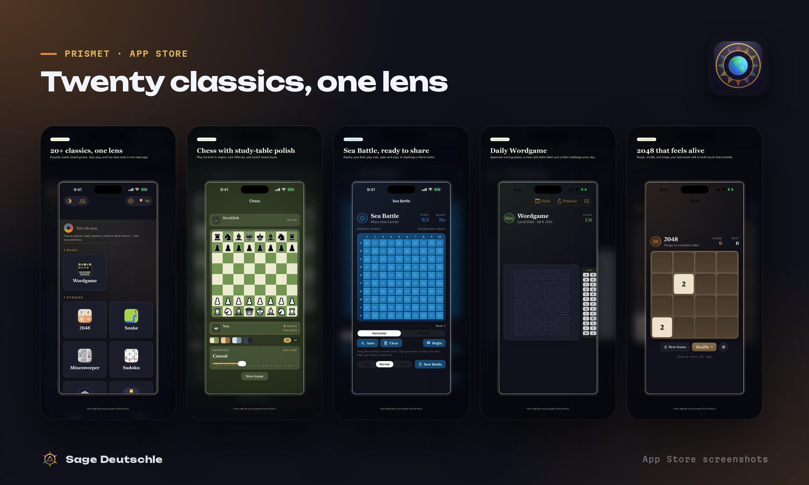 |
| 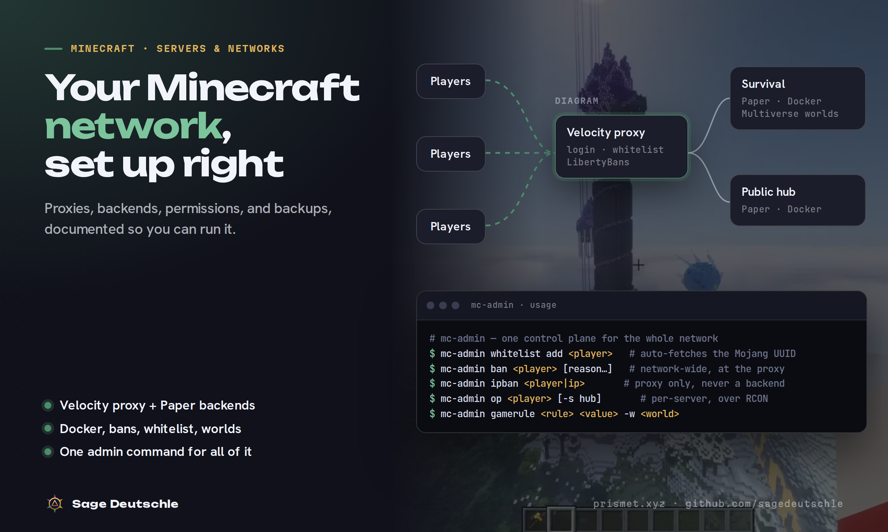 | 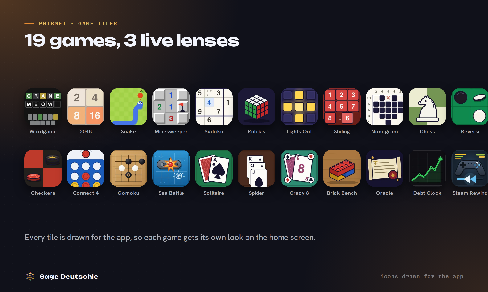 |
| 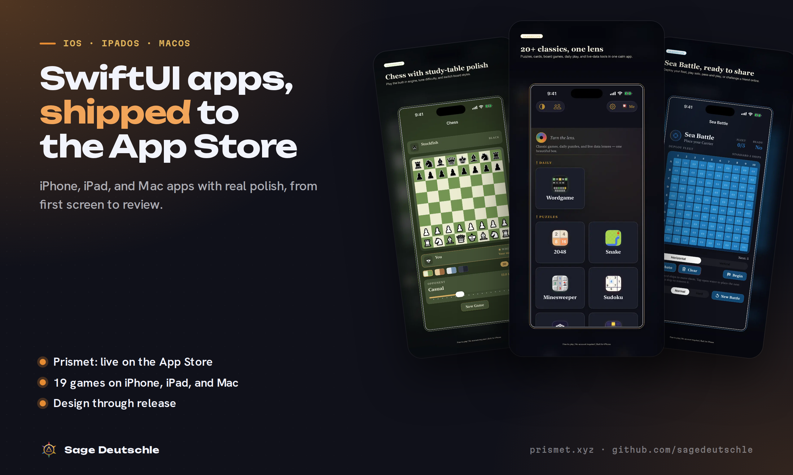 | 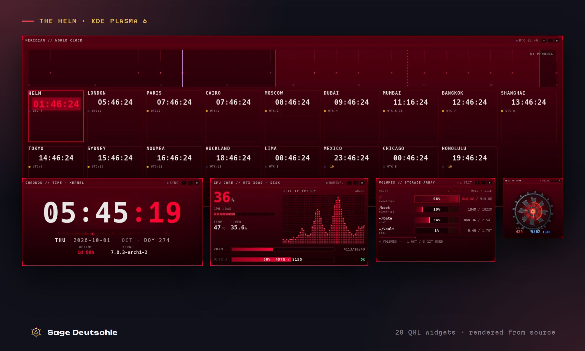 |
| 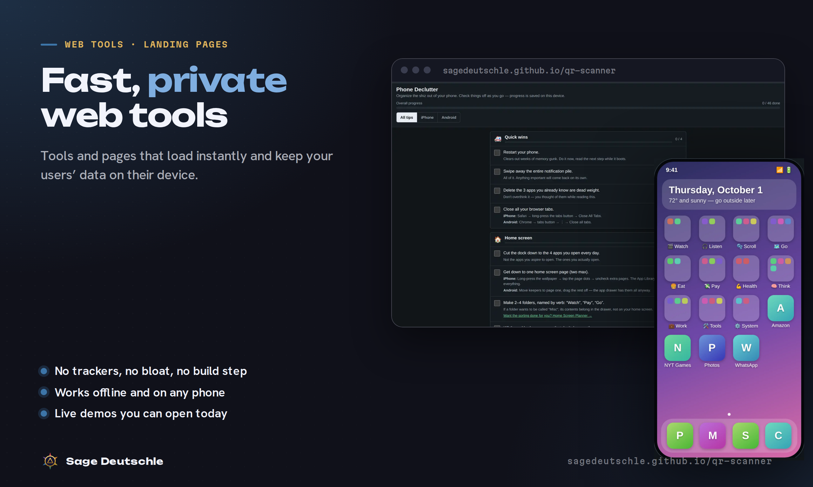 | 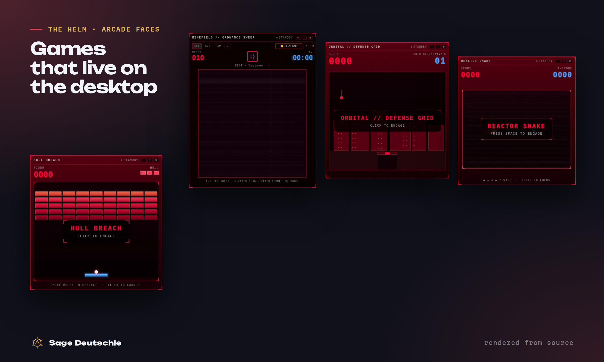 |
| 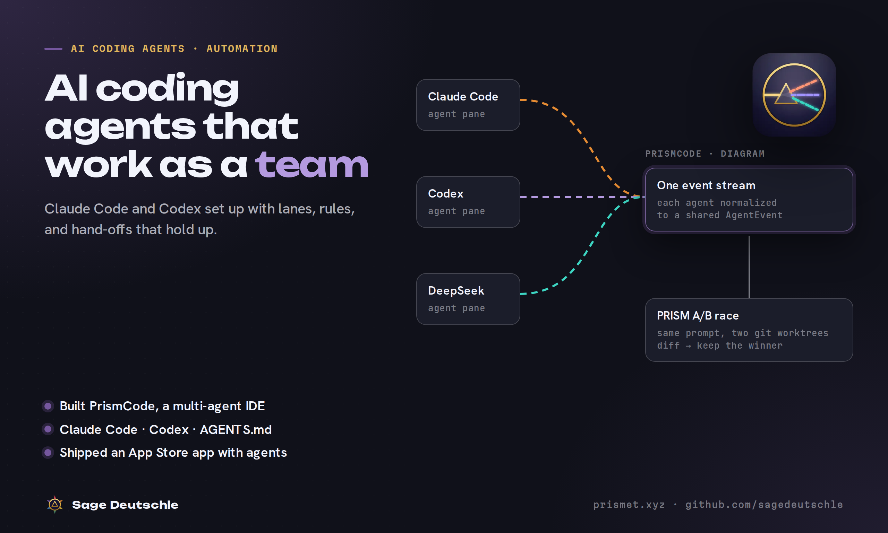 | 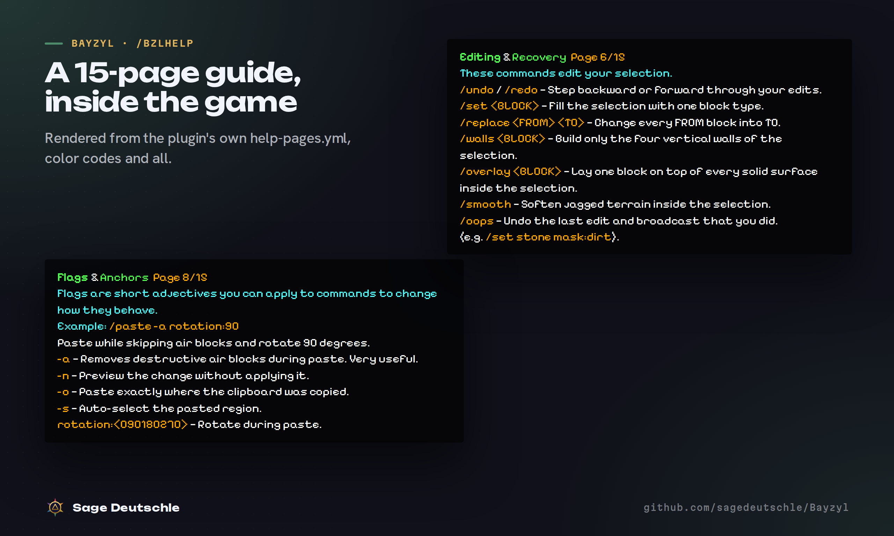 |
| 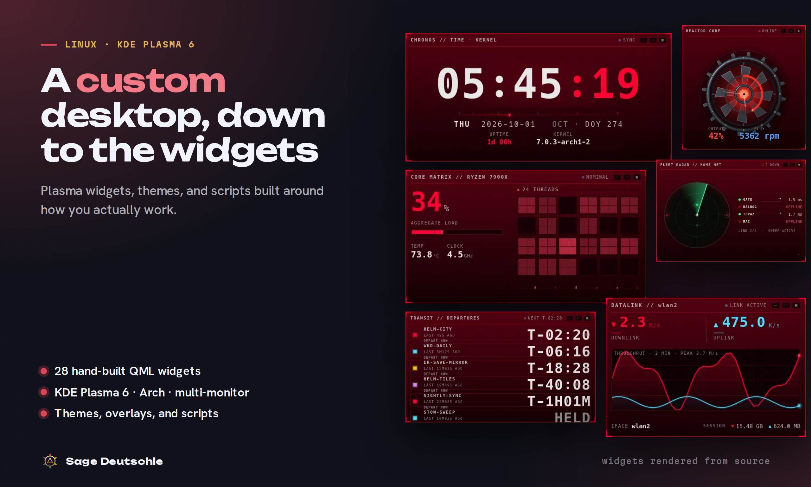 | 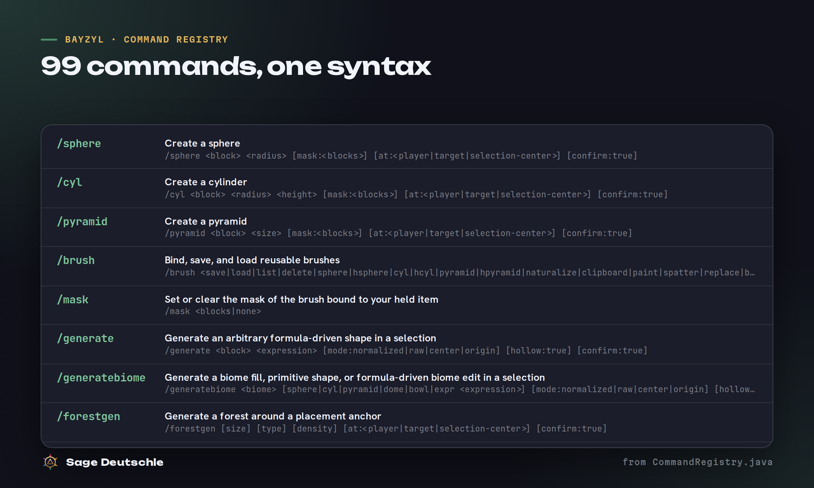 |
| | 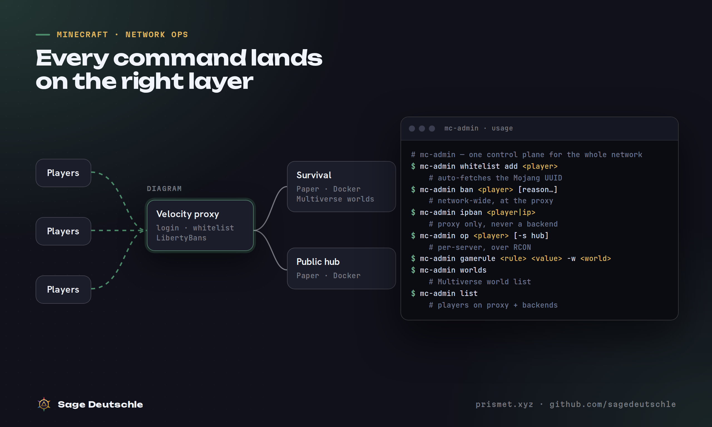 |
| | 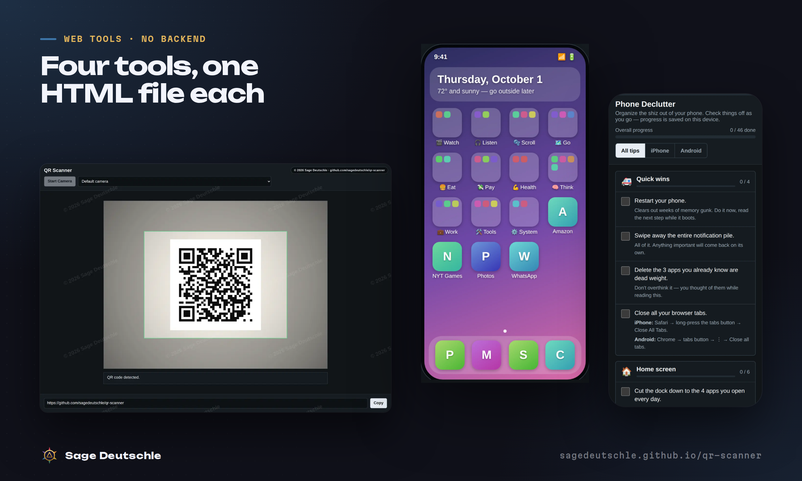 |
| | 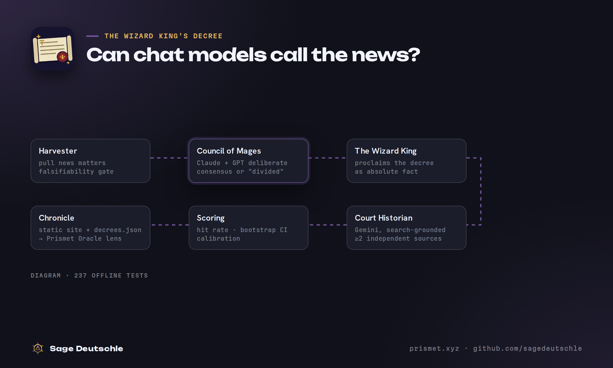 |

Also: [`out/linkedin-banner.png`](out/linkedin-banner.png) (1584×396) refreshes your LinkedIn
background with the full range instead of only the QR scanner.

## 1. Profile

**Display name:** Sage

**One-liner:** I build iOS apps, Minecraft plugins & AI agent setups

**Description** (490/600):

> I'm Sage, a developer who ships. My game app Prismet is live on the App Store with 19 games on iPhone, iPad, and Mac. I wrote Bayzyl, a 99-command building toolkit for Minecraft Paper servers, and I run my own Velocity server network. I also build custom KDE Plasma desktops with hand-made widgets, set up Claude Code and Codex to work as a team, and make small web tools that never phone home. I scope honestly, talk before big orders, and hand over full source. See it all at prismet.xyz.

**Skills:** Swift, SwiftUI, iOS Development, macOS Development, Java, Minecraft Plugin Development, Minecraft Server Setup, Docker, JavaScript, HTML & CSS, TypeScript, Electron, QML, Linux, Python, AI Agents, Prompt Engineering

**Languages:** English (Native/Bilingual)

**Profile photo:** a clear, well-lit headshot outperforms a logo on Fiverr. If you'd rather not
show your face, use the Prismet app icon (`showcase/assets/icons/prismet-app.webp`).

## 2. Gigs

### 1. I will develop a custom Minecraft plugin for your Paper or Spigot server

- **Category:** Programming & Tech → Game Development (choose the Minecraft option if listed)
- **Search tags:** `minecraft plugin` · `spigot plugin` · `paper plugin` · `minecraft java` · `minecraft server`
- **Gallery images:** [`gig-mc-plugin.png`](out/gig-mc-plugin.png), [`portfolio-mc-builds.png`](out/portfolio-mc-builds.png), [`portfolio-bayzyl-help.png`](out/portfolio-bayzyl-help.png)

| | **Small plugin** | **Feature plugin** | **Full system** |
|---|---|---|---|
| Price | $40 | $120 | $350 |
| Delivery | 3 days | 7 days | 14 days |
| Revisions | 1 | 2 | 3 |
| What's included | One feature: a command, an event hook, or a gameplay tweak. Source included. | Up to 5 commands with permissions, tab-complete, and a readable config file. | Multi-feature plugin with GUIs, saved data, and a setup guide. |

**Description** (740/1200):

```text
Need a feature no existing plugin gets quite right? I build custom plugins for Paper and Spigot (Java 21, Minecraft 1.21+).

I'm the author of Bayzyl, an open-source building toolkit for Paper with 99 commands, 25+ brush types, per-player undo that survives restarts, and a 15-page in-game help guide. Your plugin gets the same care:
• Consistent commands with permissions and tab-completion
• A config file you can actually read
• Confirmations before anything destructive
• Built to sit alongside WorldEdit and FastAsyncWorldEdit

What you get:
• A compiled .jar, ready to drop in
• Full source code, yours to keep
• A short setup guide

Message me before ordering with what the plugin should do. I'll confirm scope and timeline up front.
```

**FAQ**

- **Which versions do you support?** Paper and Spigot on Minecraft 1.21+ with Java 21 by default. Older versions are possible, so ask first.
- **Do I get the source code?** Yes. Every package includes the full source and the compiled .jar.
- **Can you fix or update an existing plugin?** Usually, if you have its source. Send me the plugin and a description of the problem.

**Requirements (questions buyers answer when ordering)**

1. What should the plugin do? Describe it like you'd explain it to a player.
1. Server software and version (for example Paper 1.21.4).
1. Which other plugins are installed?

### 2. I will set up your Minecraft server or Velocity network with Docker

- **Category:** Programming & Tech → Game Development (or the server setup option if listed)
- **Search tags:** `minecraft server` · `velocity proxy` · `minecraft network` · `paper server` · `server setup`
- **Gallery images:** [`gig-mc-server.png`](out/gig-mc-server.png), [`portfolio-mc-network.png`](out/portfolio-mc-network.png), [`portfolio-mc-builds.png`](out/portfolio-mc-builds.png)

| | **Single server** | **Proxy network** | **Run-it-yourself** |
|---|---|---|---|
| Price | $35 | $110 | $260 |
| Delivery | 2 days | 5 days | 10 days |
| Revisions | 1 | 2 | 3 |
| What's included | One Paper server with core plugins, permissions, and automatic backups. | Velocity proxy plus 2 Paper backends with whitelist, bans, and worlds. | Full network in Docker, an admin command for daily tasks, and a runbook. |

**Description** (769/1200):

```text
I run my own Minecraft network: a Velocity proxy in front of Paper backends in Docker (a multi-world survival server and a public hub), with network-wide bans, a whitelist gate, and Multiverse worlds. One admin command sends every task to the layer where it belongs, so an IP ban never locks out the whole proxy.

I'll set up yours the same way:
• Paper server tuned for your player count
• Velocity proxy with secure player forwarding
• Whitelist, bans, and permissions at the right layer
• Multiverse worlds and per-world gamerules
• Docker containers, so restarts and moves are painless
• Automatic backups
• A plain-English runbook so you can run it without me

You provide the machine: a VPS, a home server, or a panel host. I do the setup and walk you through it.
```

**FAQ**

- **Do you provide hosting?** No. I set up on your VPS, dedicated server, home machine, or panel host, and can suggest options if you don't have one yet.
- **What access do you need?** SSH or panel access to the machine for the duration of the order. Change the password when we're done.
- **Can you migrate my existing server?** Yes. Your worlds and plugin data move over, and I'll test before switching.

**Requirements (questions buyers answer when ordering)**

1. Where will it run (VPS, home server, panel host) and its specs?
1. Expected player count and game style (survival, creative, minigames).
1. Any plugins or worlds you already use.

### 3. I will build your iPhone, iPad, or Mac app in SwiftUI

- **Category:** Programming & Tech → Mobile App Development → iOS
- **Search tags:** `swiftui` · `ios app` · `iphone app` · `macos app` · `app store`
- **Gallery images:** [`gig-ios-app.png`](out/gig-ios-app.png), [`portfolio-prismet-spread.png`](out/portfolio-prismet-spread.png), [`portfolio-prismet-tiles.png`](out/portfolio-prismet-tiles.png)

| | **Feature or fix** | **Focused app** | **Ship it** |
|---|---|---|---|
| Price | $80 | $600 | $1500 |
| Delivery | 4 days | 21 days | 45 days |
| Revisions | 1 | 2 | 3 |
| What's included | One SwiftUI screen, feature, or bug fix in your existing app. | A focused app with up to 5 screens, local data, and polished UI. | Full app with sync or accounts, plus App Store listing and submission. |

**Description** (745/1200):

```text
I build native apps in SwiftUI and ship them. My app Prismet is live on the App Store: 19 classic games and 3 live-data lenses on iPhone, iPad, and Mac. It has a tunable Stockfish chess engine in 2D and 3D, a real SceneKit Rubik's Cube, online friend games, Game Center, and light, parchment, and dark themes, backed by hundreds of tests.

What I can do for you:
• New apps, from idea to App Store review
• Features and fixes in an existing SwiftUI codebase
• iPhone-to-Mac ports with real feature parity
• Polish passes: animation, haptics, sound, and accessibility
• App Store listing: screenshots, keywords, and submission

You get the full Xcode project and source. Message me first with your idea so I can quote scope and timeline honestly.
```

**FAQ**

- **Do I need a Mac or a developer account?** You'll need an Apple Developer account to publish. I build and test on my own Macs.
- **Can you work on my existing app?** Yes, if it's Swift or SwiftUI. Share the repo and I'll review it before quoting.
- **Do you do Android too?** No. I focus on Apple platforms so the result feels native.

**Requirements (questions buyers answer when ordering)**

1. What does the app do, and who is it for?
1. Screens or sketches you already have, even rough ones.
1. Existing repo link, if any.

### 4. I will build a fast, private web tool or landing page with no bloat

- **Category:** Programming & Tech → Website Development
- **Search tags:** `landing page` · `web tool` · `javascript` · `html css` · `website`
- **Gallery images:** [`gig-web-tool.png`](out/gig-web-tool.png), [`portfolio-qr-suite.png`](out/portfolio-qr-suite.png)

| | **Single page** | **Web tool** | **Site + tool** |
|---|---|---|---|
| Price | $60 | $180 | $450 |
| Delivery | 3 days | 7 days | 14 days |
| Revisions | 1 | 2 | 3 |
| What's included | One responsive page or small tool, plus help getting it hosted. | An interactive tool that saves on-device, works on phones and offline. | A multi-page site built from your content, plus one interactive tool. |

**Description** (857/1200):

```text
Most pages load megabytes of scripts to show a few paragraphs. Mine don't.

My QR scanner is a single HTML file with no backend and no build step. It uses the browser's built-in barcode detector with a fallback for older browsers, works offline, and never sends anything off your device. Its siblings, a phone declutter checklist, a home-screen planner with a 300+ app catalog, and an Apple Music playlist maker, follow the same rules. My own site, prismet.xyz, serves live data with a tiny footprint.

I'll build you:
• Landing pages and personal sites that load fast on any phone
• Calculators, checklists, planners, and other small tools
• Data pages that pull from a public API
• Light and dark themes, keyboard and screen-reader friendly

You get clean HTML, CSS, and JavaScript you can host anywhere: GitHub Pages, Netlify, Fly.io, or your own server.
```

**FAQ**

- **Will I need a server?** Usually not. Most of what I build runs as static files on free hosting like GitHub Pages.
- **Can you use React or a page builder?** I can, but I'll recommend plain HTML when it does the job faster and lasts longer.
- **Do you write the copy?** I'll polish what you give me. For full copywriting, send notes and I'll draft it.

**Requirements (questions buyers answer when ordering)**

1. What should the page or tool do?
1. Text, logo, and images you want used.
1. Any site you like the feel of.

### 5. I will set up Claude Code and Codex agents to build your project as a team

- **Category:** Programming & Tech → AI Development (or AI Agents)
- **Search tags:** `claude code` · `ai agents` · `ai automation` · `codex` · `ai coding`
- **Gallery images:** [`gig-ai-agents.png`](out/gig-ai-agents.png), [`portfolio-oracle.png`](out/portfolio-oracle.png)

| | **Agent setup** | **Team workflow** | **Custom tooling** |
|---|---|---|---|
| Price | $60 | $180 | $480 |
| Delivery | 2 days | 5 days | 10 days |
| Revisions | 1 | 2 | 3 |
| What's included | CLAUDE.md, AGENTS.md, and permission rules tuned for one repo. | Multi-agent lanes, a coordination ledger, hooks, and a recorded walkthrough. | Custom agent tooling: scripts, an MCP server, or an LLM pipeline with tests. |

**Description** (867/1200):

```text
I use AI coding agents every day, and I've built the tooling to run them well.

• PrismCode: a desktop IDE that runs Claude Code, Codex, and DeepSeek side by side and races two agents on the same prompt in separate git worktrees, so you keep the better result.
• Agent Ops: a written protocol that let several Claude and Codex agents, run by two people, ship an App Store release without stepping on each other's work.
• The Wizard King's Decree: an LLM council that forecasts the news, graded by a separate search-grounded model, with 237 offline tests.

I'll set up your repo so agents help instead of making a mess:
• CLAUDE.md and AGENTS.md written for your codebase
• Permission rules, hooks, and safe defaults
• Lanes and hand-off rules for multiple agents
• Custom scripts or MCP servers where they pay off

I explain every choice so your team can maintain it.
```

**FAQ**

- **Which tools do you support?** Claude Code and OpenAI Codex first. I can wire in local models through Ollama too.
- **Do you need access to my code?** Read access to the repo is enough for the setup packages. Nothing is shared outside the order.
- **Will this work for a solo developer?** Yes. The Agent setup package is built for one person and one repo.

**Requirements (questions buyers answer when ordering)**

1. Repo link or a description of the codebase and stack.
1. Which agents and plans you use today.
1. What goes wrong now when you use them.

### 6. I will customize your KDE Plasma desktop with custom widgets and themes

- **Category:** Programming & Tech → Desktop Applications (or Customization)
- **Search tags:** `kde plasma` · `linux rice` · `linux desktop` · `qml widget` · `arch linux`
- **Gallery images:** [`gig-linux-desktop.png`](out/gig-linux-desktop.png), [`portfolio-helm-wall.png`](out/portfolio-helm-wall.png), [`portfolio-helm-arcade.png`](out/portfolio-helm-arcade.png)

| | **Theme pass** | **Custom widgets** | **Full system** |
|---|---|---|---|
| Price | $40 | $140 | $380 |
| Delivery | 3 days | 7 days | 14 days |
| Revisions | 1 | 2 | 3 |
| What's included | Colors, fonts, panels, and wallpaper set up as one cohesive look. | Theme plus 3 custom QML widgets, like system stats, clocks, or launchers. | Multi-monitor layout, custom widgets, scripts, and a one-command installer. |

**Description** (726/1200):

```text
My daily driver is THE HELM: a red-on-black command bridge across three monitors on Arch Linux and KDE Plasma 6. It has 28 hand-built QML widgets (CPU, GPU, network, storage, a fleet radar, a world clock, even Breakout and Minesweeper), fullscreen app overlays, floating toys, a live packet scope, and one command that installs and manages all of it.

I'll build yours:
• A cohesive theme: palette, fonts, panels, window rules, wallpapers
• Custom Plasma 6 widgets in QML that show what you care about
• Multi-monitor layouts that restore themselves
• Scripts and shortcuts for the things you do every day
• Dotfiles in a git repo with an installer, so you can rebuild it anywhere

Works on any distro that ships KDE Plasma 6.
```

**FAQ**

- **Do you need remote access?** Not always. I can deliver a dotfiles repo with an installer you run yourself, or work over SSH if you prefer.
- **What about GNOME or Hyprland?** My focus is KDE Plasma 6. Ask about others before ordering.
- **Can I undo it?** Yes. I back up your current config first and include a restore step.

**Requirements (questions buyers answer when ordering)**

1. Distro, Plasma version, and monitor setup.
1. Screenshots or descriptions of looks you like.
1. What you want to see at a glance (stats, calendar, media, etc.).

## 3. Portfolio

Fiverr → your profile → **Portfolio** → **Add project**. For each, upload the images, paste
the description, and link the matching gig so buyers see proof on the gig page too.

### Prismet: 19 games on the App Store

- **Images:** [`portfolio-prismet-spread.png`](out/portfolio-prismet-spread.png), [`portfolio-prismet-tiles.png`](out/portfolio-prismet-tiles.png)
- **Linked gig:** I will build your iPhone, iPad, or Mac app in SwiftUI

> A SwiftUI games app live on the App Store for iPhone, iPad, and Mac: chess with a tunable engine in 2D and 3D, a SceneKit Rubik's Cube, online friend games, Game Center, and three live-data lenses.

### THE HELM: a custom KDE Plasma desktop

- **Images:** [`portfolio-helm-wall.png`](out/portfolio-helm-wall.png), [`portfolio-helm-arcade.png`](out/portfolio-helm-arcade.png)
- **Linked gig:** I will customize your KDE Plasma desktop with custom widgets and themes

> A three-monitor command-bridge desktop with 28 hand-built QML widgets, overlays, floating toys, and a one-command installer. Every widget shown here was rendered from its source.

### Bayzyl: a 99-command Paper plugin

- **Images:** [`portfolio-mc-builds.png`](out/portfolio-mc-builds.png), [`portfolio-bayzyl-help.png`](out/portfolio-bayzyl-help.png), [`portfolio-bayzyl-commands.png`](out/portfolio-bayzyl-commands.png)
- **Linked gig:** I will develop a custom Minecraft plugin for your Paper or Spigot server

> An open-source building toolkit for Paper servers: selections, shapes, 25+ brushes, persistent undo, shared kits, and a 15-page in-game guide.

### A Velocity network in Docker

- **Images:** [`portfolio-mc-network.png`](out/portfolio-mc-network.png)
- **Linked gig:** I will set up your Minecraft server or Velocity network with Docker

> A Velocity proxy with network-wide bans and a whitelist gate in front of Dockerized Paper backends, run day to day with a single admin command.

### Four one-file web tools

- **Images:** [`portfolio-qr-suite.png`](out/portfolio-qr-suite.png)
- **Linked gig:** I will build a fast, private web tool or landing page with no bloat

> A QR scanner, phone declutter checklist, home-screen planner, and Apple Music playlist maker. Each is one HTML file with no backend that keeps data on the device.

### The Wizard King's Decree

- **Images:** [`portfolio-oracle.png`](out/portfolio-oracle.png)
- **Linked gig:** I will set up Claude Code and Codex agents to build your project as a team

> An LLM forecasting experiment: a Claude + GPT council commits to news predictions, a search-grounded Gemini judge grades them with sources, and 237 offline tests keep it honest.

**Still to add (needs you):** *Westeros for UEBS 2*. Drop 3–6 screenshots into
`showcase/assets/worlds/`, fill in the `westeros-uebs2` entry in
`showcase/prismet-site/data/projects.json`, and it shows up on prismet.xyz and here.

## 4. Upload order

1. **Profile first.** Paste the description and one-liner, add the skills, and set your photo.
2. **Publish gigs one at a time**, strongest proof first: iOS apps → Minecraft plugins →
   Minecraft servers → AI agents → web tools → Linux desktops.
   For each: Overview (title, category, tags) → Pricing (three packages, matching the table) →
   Description & FAQ → Requirements → Gallery (images in the listed order; the first one is
   the cover) → Publish.
3. **Portfolio last**, linking each project to its gig.
4. **Point everything at everything:** put `prismet.xyz` in your Fiverr description and
   LinkedIn, and the redesigned prismet.xyz has a "Hire me on Fiverr" button and a list of
   these same six services.

## 5. After launch

- Answer messages fast. Response time is one of the signals Fiverr ranks new sellers on.
- After the first few orders, raise prices on whichever gig fills up first.
- Re-render the images after shipping something new:
  `node showcase/fiverr/render.mjs` (gig covers + boards), then `node showcase/fiverr/kit.mjs`.
